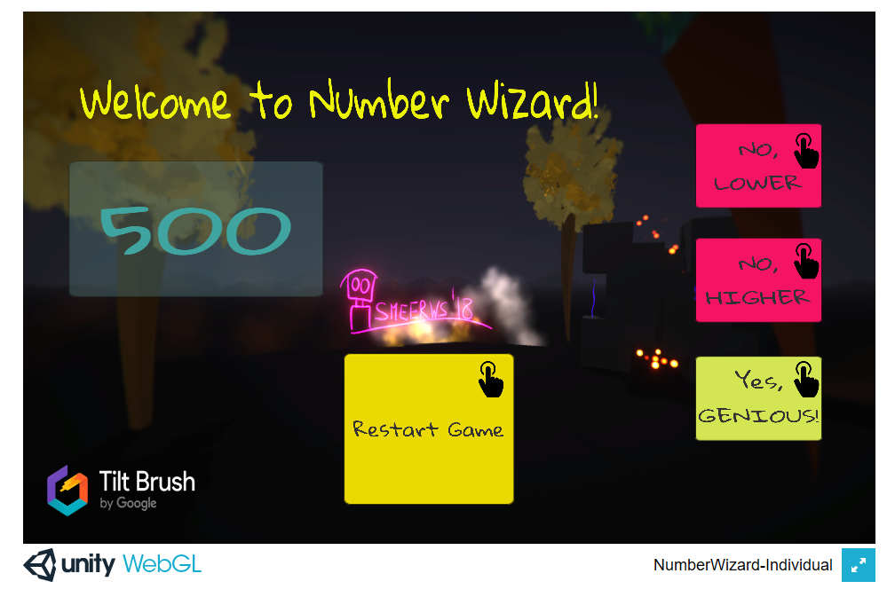
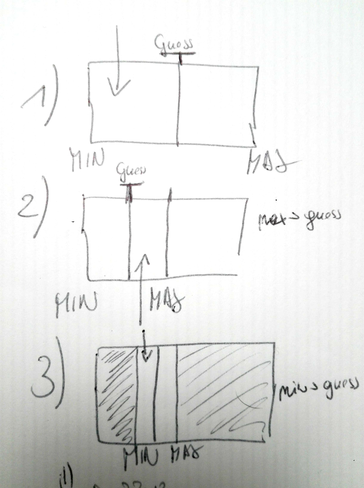

# NumberWizard-UI, guessing game

Developed on Windows 10 with Unity Version 2018.2.6f1, as Browsergame (WebGL export)

Desc: A player chooses a number (secret) between 1 and 1000. The System guesses a number (min+max)/2 as long as the guess isn't equal to the secret number. 
After each system's guess, the player confirms with eighter "number is lower", "number is higher" or "number is" guess.

----------------------
GameMechanics: 

guess = ( min + max ) / 2 --> updated with Random(min,max+1)

if secret number < guess --> max = guess

if secret nubmer > guess --> min = guess

https://www.matheretter.de/rechner/logarithmus
https://medium.com/karuna-sehgal/a-simplified-interpretation-of-binary-search-246433693e0b

------------------------
